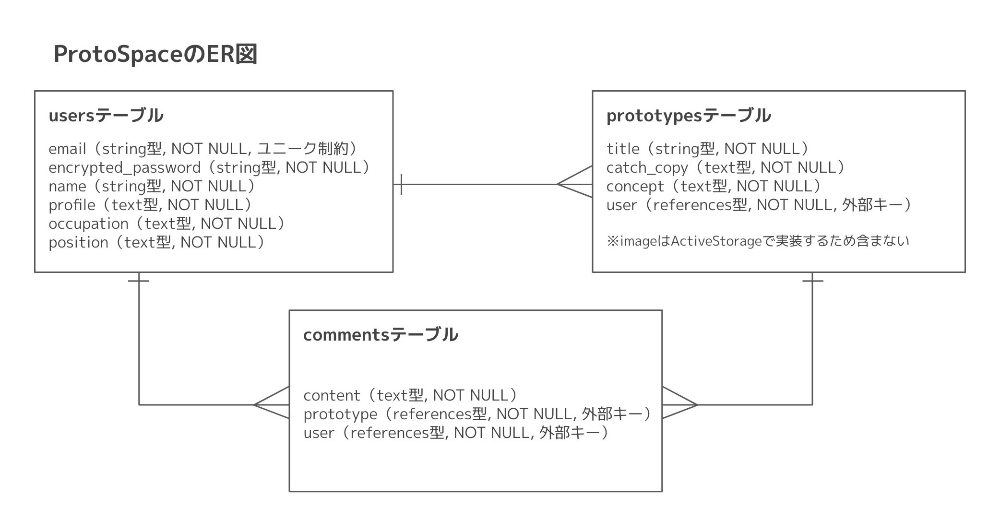

# ProtoSpace

## ER図

## テーブル設計

### usersテーブル

| カラム名             | 型         | オプション                     |
|----------------------|------------|--------------------------------|
| email                | string     | NOT NULL, ユニーク制約         |
| encrypted_password   | string     | NOT NULL                      |
| name                 | string     | NOT NULL                      |
| profile              | text       | NOT NULL                      |
| occupation           | text       | NOT NULL                      |
| position             | text       | NOT NULL                      |

#### Association
- has_many :prototypes
- has_many :comments

### prototypesテーブル

| カラム名             | 型         | オプション                     |
|----------------------|------------|--------------------------------|
| title                | string     | NOT NULL                      |
| catch_copy           | text       | NOT NULL                      |
| concept              | text       | NOT NULL                      |
| user                 | references | NOT NULL, 外部キー            |

#### Association
- belongs_to :user
- has_many :comments

### commentsテーブル

| カラム名             | 型         | オプション                     |
|----------------------|------------|--------------------------------|
| content              | text       | NOT NULL                      |
| prototype            | references | NOT NULL, 外部キー            |
| user                 | references | NOT NULL, 外部キー            |

#### Association
- belongs_to :user
- belongs_to :prototype

## 備考
- `prototypes`テーブルの`image`はActiveStorageで実装するため、テーブル設計には含めていません。